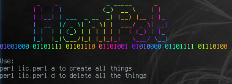

# HoniPot
#          _    _             _ _____      _
#         | |  | |           (_)  __ \    | |
#         | |__| | ___  _ __  _| |__) |__ | |_
#         |  __  |/ _ \| '_ \| |  ___/ _ \| __|
#         | |  | | (_) | | | | | |  | (_) | |_
#         |_|  |_|\___/|_| |_|_|_|   \___/ \__|
#01001000 01101111 01101110 01101001 01010000 01101111 01110100

 

<h2>About app</h2>

This app is for impoving your home network security. Honipot is an honeypot scripted in perl.

  
<h2>Requierments</h2>
<ul><li>perl5 (tested on perl5.28.2)
  <li>lolcat
  <li>Perl packages:<ul><li>NetAddr::IP
                        <li>CGI
                        <li>HTTP::Server::Simple::CGI
    </ul>
</ul>
